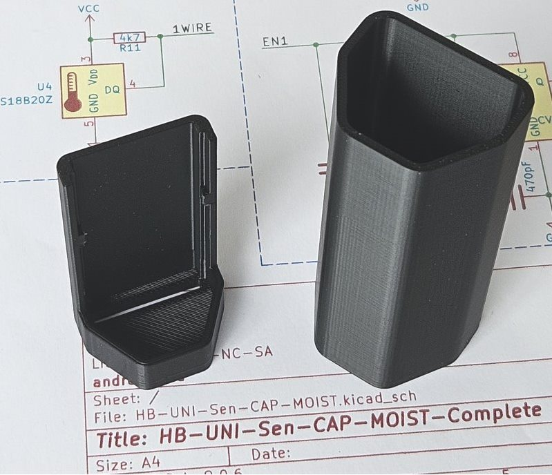
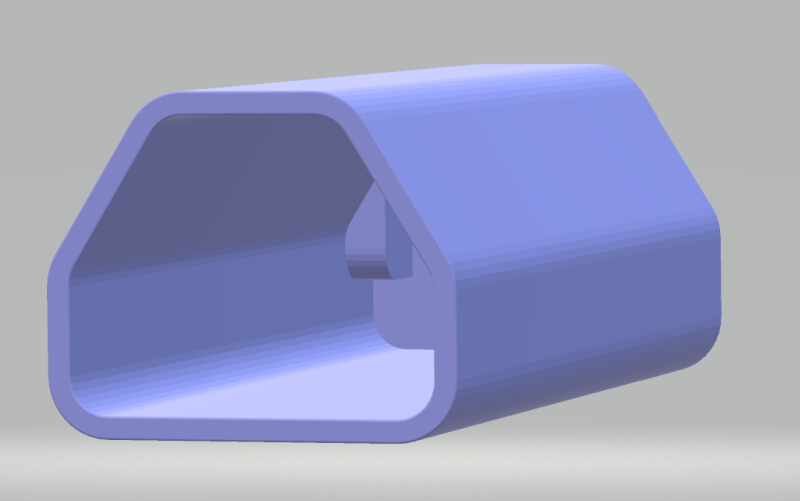
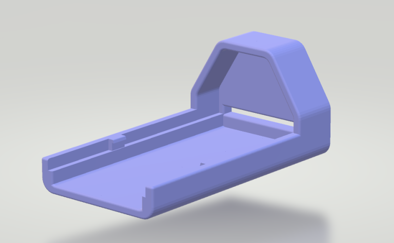
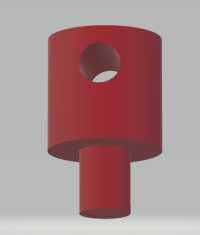

# Gehäuse

Einfaches Gehäuse, Platine wird eingeklipst und hält zusätzlich durch die Kappe.

Die Dateien lassen sich ohne Support drucken, ich habe PETG auf einem BambuLab im Standardprofil verwendet.

Die Leiterplatte sollte mit Schutzlack versehen sein, mit wenig Silikon im Sockel abdichten. Richtig in die Snap-Verbindung drücken.
Die Kappe passt leicht drauf. 

2 Stück der Antennenhalter werden gebraucht. Die Antenne sitzt auf der Batterieseite. Die Halter einstecken und mit dem Lötkolben auf der Bestückungsseite sichern.

STL Dateien  |
------------ | 
[Kappe.stl](Kappe.stl)|
[Sockel.stl](Sockel.stl)|
[Antennenhalter.stl](Antennenhalter.stl) (2 Stück)|

