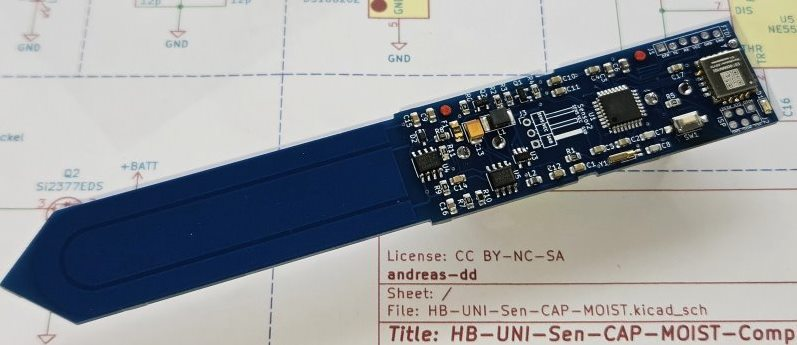
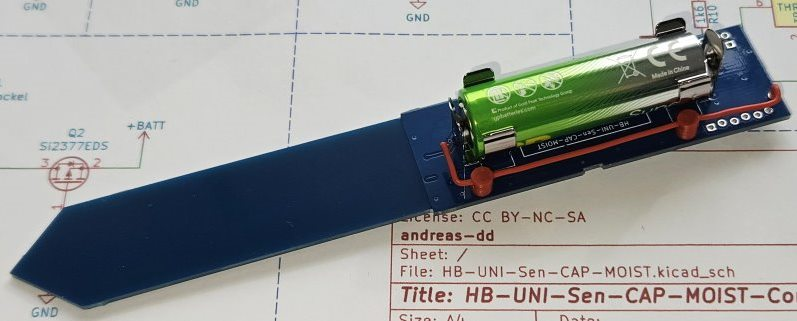
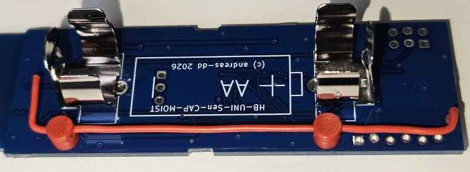

# Platine und Schaltung

Hier findet sich das KiCad Projekt.
Die Batteriekontakte sind [Keystone Electronics 92](https://www.conrad.de/de/p/keystone-electronics-92-einzelkontakt-1x-mignon-aa-a-cr-2-durchsteckmontage-tht-b-x-h-12-mm-x-15-mm-651036.html).
Das Funkmodem ist ein Modul von [EByte](https://www.amazon.de/dp/B0BRZTSYPM?ref=ppx_yo2ov_dt_b_fed_asin_title&th=1).
Es kann ein zusätzlicher kapazitiver Sensor angeschlossen werden, ist im Sketch aber auskommentiert. Ebenfalls kann der Temperatursensor entfallen, dafür muss im Sketch in Zeile 15
```
   #define NO_DS18B20 
```
aktiviert werden.

## Bestückung
Beim ersten Exemplar habe ich nacheinander den Spannungsregler, dann den integrierten Sensor bestückt und geprüft. Danach den Prozessor verlötet sowie Fuses und Firmware programmiert. Zum Schluss das Funkmodem auflöten. Die nachfolgenden Platinen sind auf einen Rutsch mit Lötpaste und Heißluft bestückt worden, das Funkmodem nur an den markierten Kontakten mit dem Lötkolben. 




Die Antenne nicht vergessen, dafür einen 83mm langen Draht auf der Batterieseite bestücken und durch die [Antennenhalter](../Gehaeuse) fädeln:


# Schaltplan
der Schaltplan ist als [PDF verfügbar](HB-UNI-Sen-CAP-MOIST-Complete.pdf)


