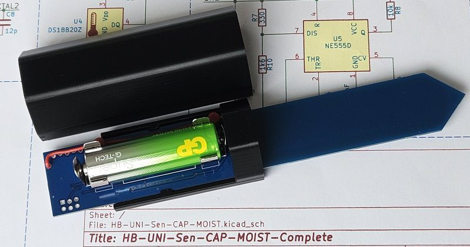
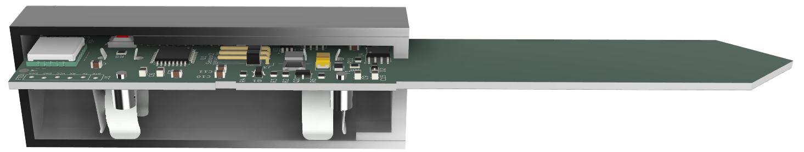
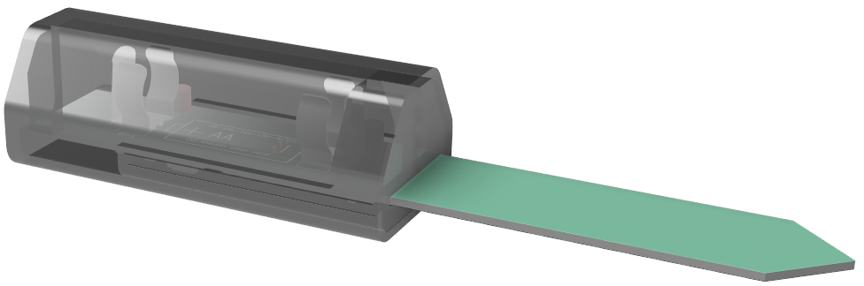
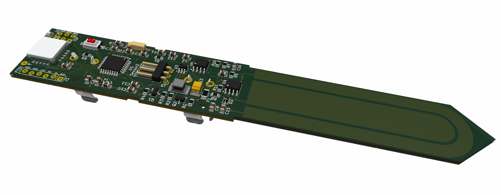

# HB-UNI-Sen-CAP-MOIST-Complete 

Bodenfeuchtesensor komplett auf einer Platine im kompakten Gehäuse. Die Schaltung wurde um einen integrierten Sensor ergänzt, es kann ein zusätzlicher kapazitiver Sensor angeschlossen werden (ist im Sketch aber auskommentiert).
Die Idee und das Prinzip stammen von [Jérôme](https://github.com/jp112sdl/HB-UNI-Sen-CAP-MOIST), die Schaltung im Wesentlichen von [Marco](https://github.com/stan23/myPCBs/tree/master/HB-UNI-Sen-CAP-MOIST-T). Weiterer Dank geht an pa-pa für [AskSinPP](https://github.com/pa-pa/AskSinPP). 
Der kapazitive Sensor entspricht dem mehrfach veröffentlichten Sensor, z.B. von [DFROBOT](https://wiki.dfrobot.com/sen0193/) oder [TECHMAZE](https://www.techmaze.ae/shop/99187584-soil-capacitive-moisture-sensor-v12-21036).

# [Platine](Platine)

Das KiCad Projekt ist samt Hinweisen zur Bestückung ist [hier](Platine).

# Schaltplan
der Schaltplan ist als [PDF verfügbar](Platine/HB-UNI-Sen-CAP-MOIST-Complete.pdf) 
 
# [Gehäuse](Gehaeuse)
Das Gehäuse unterstützt nur den integrierten Sensor, wird der Anschluss für den zweiten Sensor benutzt, ist es zu eng. Irgendwelche Dichtungen habe ich weggelassen, aber die Platine ist mit Schutzlack versehen. Die Programmieranschlüsse und den Drucktaster beim Lackieren unbedingt aussparen. Mit wenig Silikon in der Gehäusedurchführung abdichten. Der Deckel geht leicht ab, so muss der Sensor nicht aus der Erde um die Batterie zu wechseln. Das funktioniert in relativ geschützter Umgebung gut. 

[STL-Dateien](Gehaeuse)

# Firmware

## Fuses 
Vielen Dank an Marco, der mir an dieser Stelle weitergeholfen hat.

"C:\Program Files (x86)\Arduino\hardware\tools\avr\bin\avrdude.exe" -C "C:\Program Files (x86)\Arduino\hardware\tools\avr\etc\avrdude.conf" -p m328p -P com3 -c stk500v2 -U lfuse:w:0xE2:m -U hfuse:w:0xD2:m -U efuse:w:0xFF:m

## Bootloader
"C:\Program Files (x86)\Arduino\hardware\tools\avr\bin\avrdude.exe" -C "C:\Program Files (x86)\Arduino\hardware\tools\avr\etc\avrdude.conf" -p m328p -P com3 -c stk500v2 -V -U flash:w:ATmegaBOOT_168_atmega328_pro_8MHz.hex

## Angepasster Sketch
ist [hier](https://github.com/andreas-dd/HB-UNI-Sen-CAP-MOIST/tree/andreas-dd_adaption)

# Kalibrierung, Anlernen
Ist von Jérôme ausführlich [beschrieben](https://github.com/jp112sdl/HB-UNI-Sen-CAP-MOIST#kalibrierung). Evtl. muss in der CCU die Spannung für die Batteriewarnung auf 1.2V heruntergesetzt werden. Bei 1.1V schaltet der Sensor ab, darunter funktioniert der Step-Up Regler nicht mehr.

Dieses Werk ist lizenziert unter einer [Creative Commons Namensnennung - Nicht-kommerziell - Weitergabe unter gleichen Bedingungen 4.0 International Lizenz](http://creativecommons.org/licenses/by-nc-sa/4.0/).